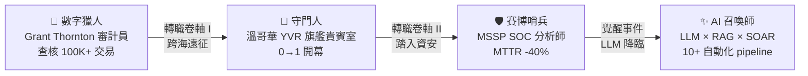
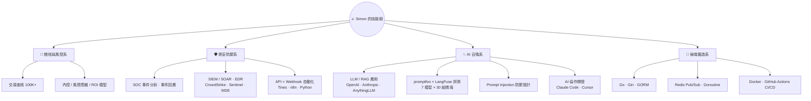

<div align="center">


<br>


</div>

> 🏰 **冒險者公會速覽（給趕時間的招募官，30 秒版）**
> 資安分析師（MSSP / SOC）× AI 自動化工程師，座標台北。前世是查核過 **100K+ 筆交易**的審計員（Grant Thornton），也曾在加拿大溫哥華 YVR 參與旗艦貴賓室**從零開幕**。現在把 API / webhook / SOAR 練成召喚術：**MTTR 降低 40%**、**15+ 企業導入 100% 準時上線**、**10+ 條自動化 pipeline** 常駐運轉，並獨立完成 **7 個 LLM 的系統性評測選型**（promptfoo / LangFuse）。
> 📫 icelafone@gmail.com ｜ [LinkedIn](https://www.linkedin.com/in/chien-chiafong-787880371) ｜ [GitHub](https://github.com/simon-CCF)
>
> <sub>🌐 **EN TL;DR** — Cybersecurity Analyst (MSSP/SOC) × AI Automation Engineer, Taipei. Ex-auditor (100K+ transactions verified). Cut MTTR by 40% with 10+ SOAR pipelines (Python / Tines / n8n); led 15+ enterprise onboardings with a 100% on-time record; benchmarked 7 LLMs for production (promptfoo / LangFuse). Stack: Python · Go · CrowdStrike · Microsoft Sentinel · Docker · GitHub Actions.</sub>

---

## 🎴 角色紙 · CHARACTER SHEET

```text
══════════════════════════════════════════════════════════
 冒險者登錄證 ADVENTURER LICENSE
──────────────────────────────────────────────────────────
 姓名 NAME    : 簡嘉鋒 CHIEN CHIA-FONG（Simon Chien）
 座標 BASE    : 台北, Taiwan（UTC+8）
 陣營 SIDE    : 藍隊 Blue Team — MSSP 資安分析師（SOC × 自動化）
 覺醒 AWAKEN  : AI 召喚師 — LLM / RAG / SOAR 自動化
 語言 LANG    : 中文（母語）· English（professional）
──────────────────────────────────────────────────────────
 屬性面板 STATUS
 偵測分析  DETECTION    ████████████████░░░░  資安事件的鷹眼
 自動流程  AUTOMATION   █████████████████░░░  手動判讀 → 系統化
 稽核之眼  AUDIT        ████████████████░░░░  100K+ 交易鍛出的直覺
 服務心流  SERVICE      ███████████████░░░░░  0→1 開幕的抗壓體質
 召喚之術  LLM CRAFT    ██████████████░░░░░░  模型評測 × RAG × 注入防禦
 後端鍛造  BACKEND      █████████████░░░░░░░  Go · API · 容器化
══════════════════════════════════════════════════════════
```

---

## 🗺️ 轉職路線圖 · CLASS CHANGE ROUTE

四次轉職，沒有一點屬性浪費——每一世的技能都疊進下一世。



---

## 📜 任務日誌 · QUEST LOG

<details open>
<summary><b>⚔️ 第四章 — 賽博哨兵 × AI 召喚師｜AIShield Co., Ltd.（MSSP 資安託管）· 台北 · 2025/09 –（現在進行式）</b></summary>
<br>

- 🏢 **導入戰役**：獨立主導 **15+ 家企業客戶**導入專案從 0 到 1 落地——客戶含台積電關聯半導體廠（市值 NT$100B+）、台灣大型貨櫃航運、頂尖醫學中心——**100% 準時上線**，零延期紀錄保持中。
- 🛡️ **常駐前線**：部署與整合 `CrowdStrike Falcon`、`Microsoft Defender for Endpoint`、`Microsoft Sentinel`、`Intezer`（含沙箱惡意程式靜態／動態分析），把「靠人腦判斷」的告警處理重鑄為可規模化的系統流程。
- ⚙️ **連鎖技**：以 webhook 為核心，用 `Python`、`Tines`、`n8n` 佈署 **10+ 條跨系統 SOAR 自動化 pipeline**（告警解析 → 情資彙整 → 自動通知），事件平均回應時間 **MTTR 降低 40%**——哨兵不用跑得比怪快，只要讓警報自己跑。
- ✨ **覺醒支線**：獨立架構端到端 **LLM 內部營運平台**——多供應商（OpenAI / Anthropic Claude）、RAG 知識庫（AnythingLLM 向量檢索）、規則式升級邏輯把複雜案件自動路由給真人；並完成 **跨 7 個商用／開源 LLM 的系統性評測選型**（成本 × 延遲 × 準確度，工具：`promptfoo`、`LangFuse`）。
- 📚 **公會文書官**：知識庫／Runbook／SOP／FAQ 文件體系唯一負責人；產出 **30 頁含 ROI 模型的評估報告**與 **25 個使用案例**的雲端平台 API 整合方案，支持客戶高層決策。

</details>

<details>
<summary><b>🛂 第三章 — 守門人｜Plaza Premium Group · 加拿大溫哥華 YVR · 2024/06 – 2025/03｜旗艦貴賓室 0→1 開幕</b></summary>
<br>

- 🌊 跨海遠征至溫哥華，參與主導**全球第三間 Plaza Premium First 旗艦貴賓室**於 YVR 溫哥華國際機場**從零到一的開幕戰役**：新地圖、新隊伍、沒有前人攻略。
- 🚪 每日以英語服務 **200+ 位國際旅客**、每班處理 **5–10 件即時事件**並依嚴重度分級升級——這份臨場力後來全數繼承給 SOC 值勤。
- 🤝 全英文多國團隊環境，練出跨文化溝通與服務現場的即時決策。

</details>

<details>
<summary><b>🧮 第二章 — 數字獵人｜Grant Thornton 正大聯合會計師事務所 · 台北 · 2018/06 – 2019/06｜查核 100K+ 交易</b></summary>
<br>

- 🔍 初始職業：審計員。獵場是帳冊與憑證，獵物是異常與風險。
- 📊 查核 **10+ 家企業客戶**、驗證 **100K+ 筆交易**、交付 **20+ 份結構化報告**，**100% 準時申報**——練成被動技「稽核之眼」：對不一致的數字天生過敏。
- 🧭 這一世留下的天賦——證據優先、控制點思維、風險意識——正是日後轉職資安時的隱藏加成。

</details>

<details>
<summary><b>🌱 序章 — 角色創建｜銘傳大學 企業管理學士（會計）· 2023/06</b></summary>
<br>

出生點：台灣。初始配點全壓「好奇心」與「不服輸」。<br>
角色設定的核心信念：**穩定跑在真實世界，才算真的會**——README 寫得再漂亮，不如系統在生產環境活著。

</details>

---

## 🌳 技能樹 · SKILL TREE

每次轉職點開一條分支，舊分支不重置——這就是轉職者的複利。



---

## 🗡️ 傳奇裝備欄 · LEGENDARY GEAR

| 裝備槽 | 裝備 | 詞綴（Affix） |
|---|---|---|
| 主手武器 | `Python` | AI 工具鏈與自動化腳本的萬用之刃 |
| 副手武器 | `Go` + `Gin` + `GORM` | 後端鍛造三件組，出招快、記憶體省 |
| 哨戒魔眼 | `CrowdStrike Falcon` · `Microsoft Sentinel` · `MDE` | 全地圖視野 + 自動反擊陷阱 |
| 連鎖法陣 | `Tines` + `n8n` + `Webhook` | 跨系統事件的瞬間移動門 |
| 咒術書 | `LLM API` + `RAG (AnythingLLM)` | 召喚多系模型，各有屬性與 mana 成本 |
| 試煉法器 | `promptfoo` + `LangFuse` | 對召喚獸施放情境試煉的審判之秤 |
| 隨行使魔 | `Claude Code` + `Cursor` | 每日出戰的 AI 協作夥伴——驗證輸出，不盲信 |
| 鎧甲 | `JWT` + `bcrypt` | 認證與雜湊的雙層護甲 |
| 攻城器械 | `Docker` + `GitHub Actions` | 一鍵展開的移動要塞（CI/CD 自動佈署） |

---

## 🏗️ 鍛造工坊 · CRAFTED ARTIFACTS

### ✨ 神器一：[AI-Task](https://github.com/simon-CCF/AI-Task) — 自然語言召喚法陣

> 對著法陣說人話（打錯字、中英日混雜、語意模糊都行），它翻譯成精準的 GitHub Search API 咒文，回傳真實存在的 repo。

- 🔮 三層法陣結構：**語意正規化 → API 執行 → 容錯處理**，查無結果時自動放寬條件（stars → pushed → fork → license → language）逐層降階重擲。
- ⚖️ 召喚獸選秀：以 `promptfoo` 對 **7 個 LLM** 進行 **30 組情境測試**——涵蓋一般查詢與對抗情境（錯字、多語混輸、矛盾條件、無效查詢、prompt injection）——比較準確度 × 延遲 × 成本，用數據決定誰能上場，而不是用感覺。
- 🛡️ 賽博哨兵的職業病寫進了程式碼：召喚獸不只要強，還要**打不歪、騙不動**。

### ⚙️ 神器二：[Mini Order & Notification System](https://github.com/simon-CCF/GO-SP2-Mini-Order-Notification-System) — 訂單通知魔像

> 一尊用 Go 鍛造、能自主接單傳訊的魔像，證明轉職者的後端分支不是裝飾點數。

- 🧱 骨架：`Go` + `Gin` + `GORM`，RESTful API 管理商品與訂單的關聯查詢。
- 📡 神經系統：`Redis Pub/Sub` 非同步訂單通知，`Goroutine` 背景更新訂單狀態並留下戰鬥日誌。
- 🔐 護甲：`JWT` 認證 + `bcrypt` 雜湊；🚀 佈署：`Docker Compose` 容器化（API / DB / cache）+ `GitHub Actions` 一鍵遠征 Render。

---

## 🏆 成就系統 · ACHIEVEMENTS

| 成就徽章 | 達成條件 | 出處章節 |
|---|---|---|
| 🥇 **迅捷哨兵** | 自動化工作流讓 MTTR **降低 40%** | 第四章 · MSSP |
| 🥇 **零延期指揮官** | **15+ 企業導入、100% 準時上線** | 第四章 · MSSP |
| 🥇 **十萬之眼** | 查核 **100K+ 筆交易**、100% 準時申報 | 第二章 · 審計 |
| 🥈 **連鎖術士** | **10+ 條**跨系統 SOAR pipeline 常駐運轉 | 第四章 · MSSP |
| 🥈 **召喚陣建築師** | 獨立架構端到端 **LLM + RAG 內部平台** | 第四章 · MSSP |
| 🥈 **開拓者** | 全球第三間 PPF 旗艦貴賓室 **0→1** 開幕成員 | 第三章 · 守門人 |
| 🥈 **馴獸師** | **7 個 LLM × 30 組情境**完整評測選型 | 鍛造工坊 · AI-Task |

---

## 🎖️ 稱號與認證卷軸 · CERTIFICATIONS

| 卷軸 | 發證公會 | 取得 |
|---|---|---|
| 🛡️ (ISC)² Certified in Cybersecurity (CC) | ISC2 | 2026 |
| ☁️ Wiz Cloud Security 認證 | Wiz | 2026 |
| 🎓 企業管理學士（會計）BBA | 銘傳大學 | 2023 |

---

## 🏰 公會招募所 · GUILD RECRUITMENT

> 正在尋找需要「**審計員的嚴謹 × 服務者的臨場 × 哨兵的警覺 × 召喚師的自動化**」的隊伍。
> 如果你的公會正在打「資安 × AI 自動化」這條副本，來信組隊。

<div align="center">

[](https://github.com/simon-CCF)
[](https://www.linkedin.com/in/chien-chiafong-787880371)
[](mailto:icelafone@gmail.com)

<br>

<sub>⚔️ 本角色卡持續升級中 —— 最近一次轉職：AI 召喚師（修煉中）· TO BE CONTINUED ⚔️</sub>


</div>
